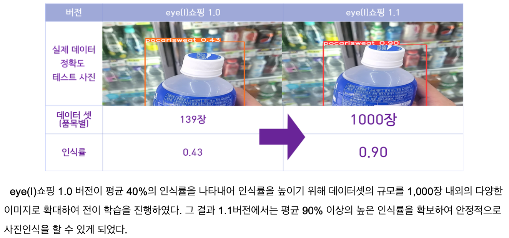
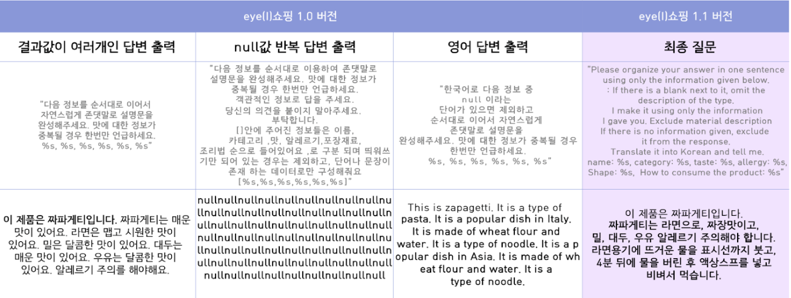
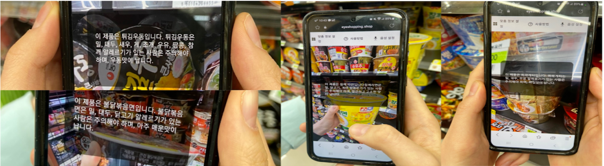

# eye-I-Shopping

<h1 align="center">
시각장애인 맞춤형 인공지능 기반  편리한 장보기 서비스
 

</h1>

# 목차 Index

- 개요
  - 시장 조사
  - 타 서비스와의 차별점
  - 파급효과
  - Architecture
- 유저 테스트
  - 서비스 활용 시나리오
  - 테스트 개선사항(버전 관리)
- Front-End
  - UI/UX
  - 문제해결 (TTS, CORS, 카메라 접근, 코드 구조화(클린코드))
- Back-End
- AI

# 1. 개요 Overview

<h2>시장 조사</h2>

시각 장애인을 주요 고객층으로 한 시장의 규모는 전 세계 3억명 국내 26만명이다. 
이들의 보조기기 시장 규모는 17조원이며, 국내 시각 장애인 이동통신단말기 시장은 500억 규모이다.

 
<h2>타 서비스와의 차별점</h2>

기존 서비스에서 제공하고 있지 않은 상품 매대인식 기능과 상품 세부정보와 유의사항을 TTS를 통해 제공하며 사용자의 사용경험을 향상시키기 위하여 음성 속도 조절 기능, 음성 선택 기능 등을 제공한다.

 
<h2>파급효과</h2>

 
<h2>Architecture</h2>

- <b>설정값 저장</b>: 사용자의 편의를 위해 각 사용자의 개별 설정값을 저장하는 기능을 구현 
- <b>설정값 리턴</b>: 사용자가 자신의 설정값을 요청할 때 데이터베이스에 저장된 설정값을 반환 
- <b>사진 전송 및 제품 인식</b>: 사용자가 제품의 사진을 전송하면, 학습된 YOLO 인공지능 모델이 제품을 인식 
- <b>인식 객체 정보 전송</b>: 인식된 제품에 대한 상세 정보를 데이터베이스에 요청 
- <b>자연어 처리된 상세 정보 리턴</b>: ChatGPT API를 활용하여 제품의 맛, 알레르기 성분, 포장 형태, 조리 방법 및 주의사항에 대한 정보들을 자연어 형태로 변환하여 반환 
- <b>TTS를 통한 음성 정보 제공</b>: Clova TTS API를 사용해 반환된 정보를 음성으로 제공한다. 사용자는 TTS 음성 선택 기능 및 음성 속도 조절 기능을 통해 개별적인 방식으로 정보 듣기 가능
   

# 2. 버전 관리 및 테스트

<h2>서비스 활용 시나리오</h2>

eye(I)쇼핑이 시각장애인들에게 독립적인 쇼핑 경험을 제공하고, 더 넓은 선택의 기회를 제공함을 입증했다. 이를 통해 eye(I)쇼핑의 궁극적인 목표인 시각장애인의 선택적 욕구를 충족시키고 그들이 사회 활동에 더욱 적극적으로 참여하는 기회를 제공하도록 나아갈 예정이다.

 
<h2>버전 관리</h2>
<h6>2) 인식률 개선</h6>

<h6>3) GPT를 통한 자연어 처리</h6>

 
<h2>전문가 테스트</h2>

2023.06.01 
경기도 OO고등학교 통합교육반 김O수 선생님의 도움을 받아 시각장애인 2명을 대상으로 편의점에서 유저 테스트를 진행. 
  유저 의견을 먼저 반영하여 1.1버전으로 개선하였으며, 김연수 선생님의 의견을 반영하여 1.2버전으로 업데이트 예정

# 3. Front-End

<h2>UI/UX</h2>
<h4>화면 구성</h4>

<h4>시각장애인 맞춤형 설계</h4>

- 보이스오버 기능과 TTS(Text-To-Speech) 기술을 통해 시각장애인의 접근성 및 사용성을 향상 
- 일관된 버튼 배치 구조로, 시각장애인 사용자의 사용성을 증진 
- 화면 컨트롤 영역을 확장하여 화면의 어느 부분을 터치해도 그에 설정된 동작이 실행

<h2>문제해결</h2>
<h4>CORS</h4>

- CORS(Cross-Origin Resource Sharing)에러 해결방안

  - Middleware Proxy 서버 이용해 클라이언트와 서버 간 통신문제 해결

  <h4>TTS</h4>

- 네이버 CLOVA Voice

  - 사용자 개별 설정 값 전달: Session Storage에 2진법을 활용한 Voice, Speed, 제공받을 정보선택 값을 저장 후 요청
  - 금액: 네이버 클라우드 제공 Credit 활용

<h4>자동 재생 정책(Autoplay Policy)</h4>
  
  - 자동 재생 제한 에러

    - oncanplaythrough를 사용 : 오디오나 비디오의 메타데이터 로딩이 완료되고, 그 이후 미디어가 끝까지 재생되는 데 중단 없이 충분한 데이터가 있는 경우에 발생
    - setTimeOut 사용
    - 해당 Button에 오디오 매핑

  <h4>카메라 접근</h4>

- IOS 접근
  - 소스에 playsInline 추가하여 해결, 카메라는 https에서만 열기 가능.
