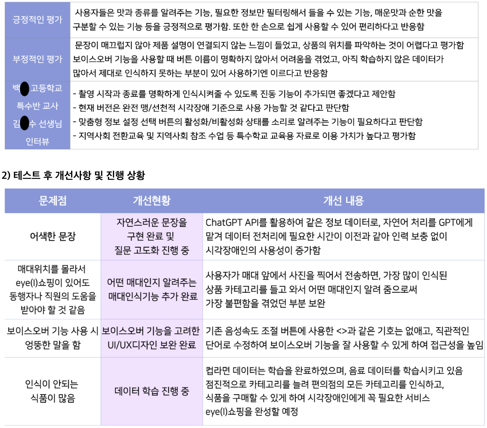
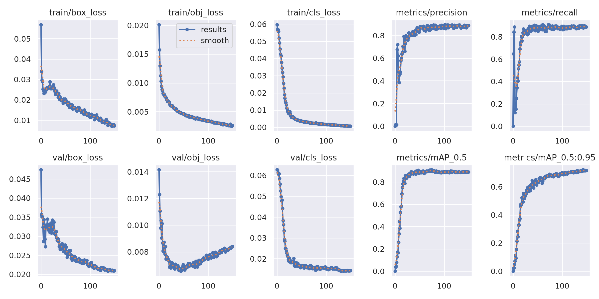
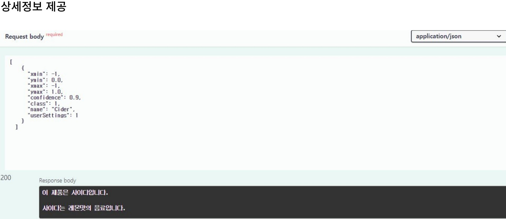
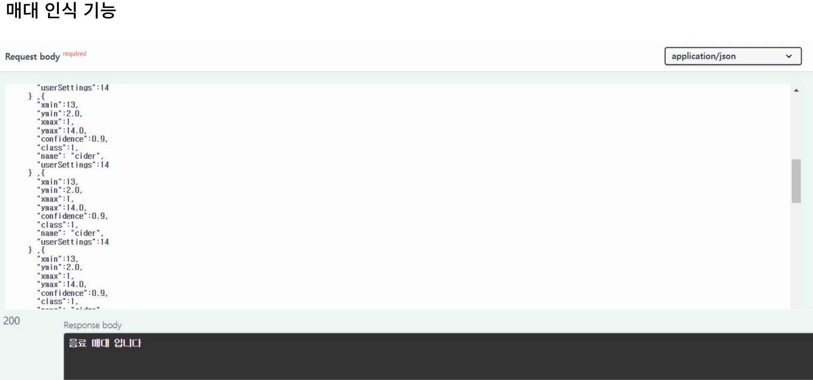
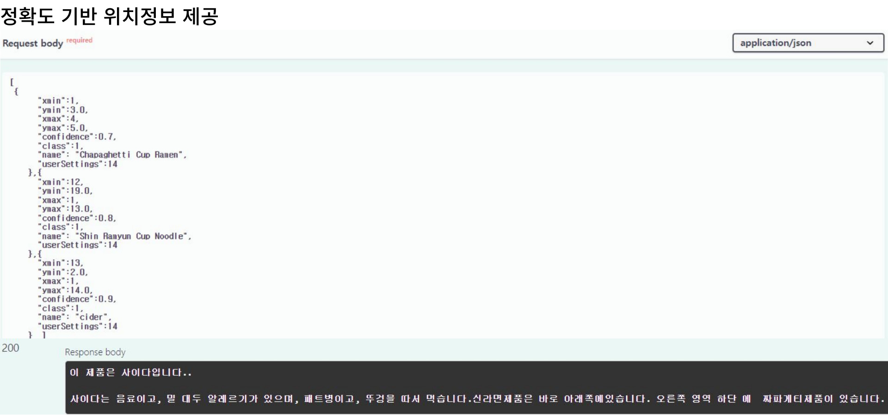
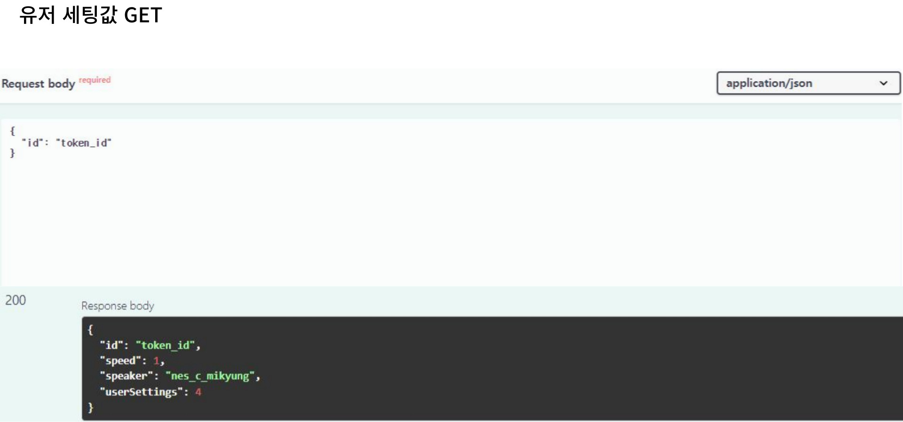
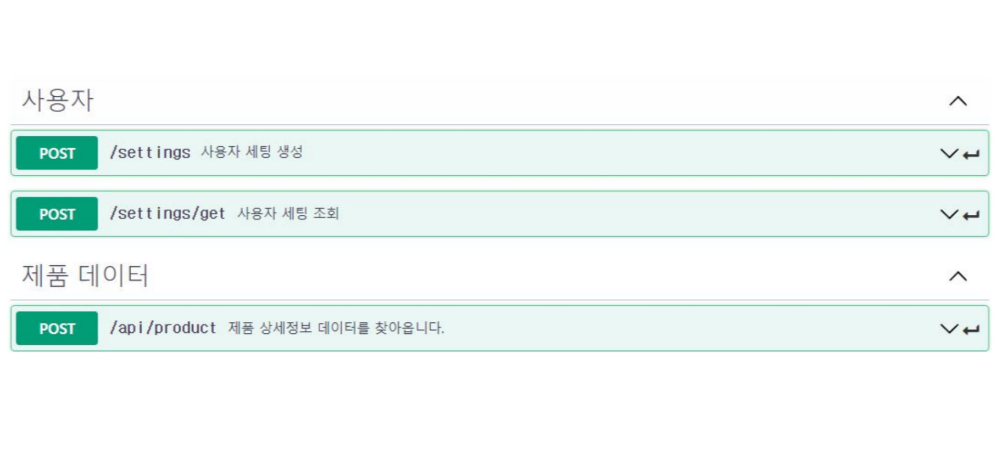

# 머신러닝과 ChatGPT를 활용한 시각장애인 맞춤형 구매 솔루션

<h1 align="center">

[아이쇼핑 바로가기](https://eyeshopping.shop:8443/#)

# 목차 Index

- 개요
  - 프로젝트 소개
  - 시장 조사
  - 서비스 활용 시나리오
  - 시스템 아키텍쳐
- 유저 테스트 및 업데이트 계획
  - 버전 관리
  - 테스트
- Front-End
  - UI/UX
  - 문제해결
- AI
- Back-End
- [프론트엔드 저장소](https://github.com/eye-I-shopping/front-end.git)
- [백엔드 저장소](https://github.com/eye-I-shopping/back-end.git)

# 1. 개요 Overview

<h2>프로젝트 소개</h2>

> eye(I) 쇼핑은 시각장애인들이 스스로 제품을 판별하고 구매하는 과정에서 겪는 정보 접근성 문제를 머신러닝을 통한
> 사진인식 기술과 ChatGPT를 활용한 자연어 처리 기술을 융복합하여 맞춤형 정보를 제공합니다.

**기획 배경**

1. 시각장애인의 선택적 구매 욕구와 사용성을 충족시키는 개인화 서비스 부재
2. 시각장애인을 돕기 위한 서비스들이 존재하긴 하나, 사용성이 미흡함
3. 점자는 시각장애인의 기호를 무시하고 제품군만 표시하는 경우가 많으며, 때로는 전혀 표시하지 않는 경우도 빈번함

 
<h2>시장 조사</h2>

시각 장애인을 주요 고객층으로 한 시장의 규모는 전 세계 3억명 국내 26만명이며 
이들의 보조기기 시장 규모는 17조원이며, 국내 시각 장애인 이동통신단말기 시장은 500억 규모입니다.

 

<h2>서비스 활용 시나리오</h2>

 
 
<h2>시스템 아키텍쳐</h2>

 
 

# 2. 유저 테스트

<h2>테스트</h2>

2023.06.01 
경기도 OO고등학교 통합교육반 김O수 선생님의 도움을 받아 시각장애인 2명을 대상으로 편의점에서 유저 테스트를 진행. 
  유저 의견을 먼저 반영하여 1.1버전으로 개선하였으며, 개선사항을 반영하여 추후 1.2버전으로 업데이트 예정

# 3. Front-End

<h2>UI/UX</h2>
<h4>화면 구성</h4>

<h4>시각장애인 맞춤형 설계</h4>

- 보이스오버 기능과 TTS(Text-To-Speech) 기술을 통해 시각장애인의 접근성 및 사용성을 향상 
- 일관된 버튼 배치 구조로, 시각장애인 사용자의 사용성을 증진 
- 화면 컨트롤 영역을 확장하여 화면의 어느 부분을 터치해도 그에 설정된 동작이 실행

<h2>문제해결</h2>
1. AutoPlay

- 문제: 브라우저의 보안 정책으로 인해 화면에서 음성 파일의 자동 재생 제한
- 해결:
  - oncanplaythrough : 오디오나 비디오의 메타데이터 로딩이 완료되고, 그 이후 미디어가 끝까지 재생되는 데 중단 없이 충분한 데이터가 있는 경우 음성 안내를 제공하여 보안 정책을 우회
  - setInterval : useState Hook을 사용해 Loading여부를 판별하고 음성 출력Interval을 handling
  - Button Mapping : client의 버튼 상호작용을 통해 음성출력 handling

2. CORS

- 문제: 브라우저에서 다른 출처로 HTTP 요청을 실행하는 것을 제한하여 웹 앱에서 데이터를 교환하는데 문제 발생
- 해결:
  - Middleware Proxy 서버 API를 사용하여 브라우저의 CORS 정책을 우회하고 데이터를 원활하게 교환할 수 있게 한다.

3. IOS Access

- 문제: iOS 카메라 접근 시 https 프로토콜을 필요로 하여 해당 요건을 만족하였음에도 카메라 접근에 실패하는 문제가 발생
- 해결:
  - iOS에서 비디오나 카메라를 제어하려면 웹 앱이 해당 리소스에 대한 지속적인 접근 권한을 가져야 하는데 전체 화면 모드가 활성화되면, 사용자 인터페이스는 웹 앱의 범위를 벗어나고 웹 브라우저 자체의 제어 아래에 있게 된다. 이 때 웹 앱이 비디오나 카메라에 대한 직접적인 제어를 할 수 없게 되므로 playsInline 속성을 사용해 전체 화면 모드로 전환되는 것을 방지한다.

4. CLOVA Voice Request

- 문제: 서비스에 회원 가입 기능이 없어 사용자 구별 및 설정 값 구현기능에 어려움
- 해결:
  - 사용자를 구별하기 위해 토큰을 활용하고, 세션 스토리지를 이용하여 사용자의 설정 값을 저장한다.  백엔드와 소통하기 위해 2진법을 사용하여 설정 값을 전달.

# 4. AI

<h4>1. 인식률 개선</h4>

인식률을 높이기 위해 데이터셋의 규모를 1,000장 내외의 다양한 이미지로 확대하여 전이 학습을 진행하였다. 
 
 

# 5. back-End

<h2>기능</h2>
<h4>1. GPT</h4>
- GPT 다빈치 모델 v2 을 사용하여 자연어 처리 구현

<h5>● 사용자 세팅값 따라 달라지는 데이터 정보를 자연스럽게 연결하기위해 GPT API를 이용해서 자연어 처리를 진행</h5>
<h5>● GPT davinci2모델을 사용할 때 질문에 따라 결과가 원하는 결과값이 안 나오는 문제 발생</h5>
<h5>● 여러가지 질문을 시도하여 최적의 질문을 찾아 원하는 결과값을 찾는 과정으로 진행</h5>
<h4>2. 상품 데이터 전달 기능</h4>

<h5>사용자 설정값을 front-end에서 back-end으로 전달하고 10진법으로 설정된 값을 데이터베이스에 token_id와 함께 저장한다. 이후 이 설정값에 숫자를 부여하여 숫자별로 데이터값을 다르게 해서 출력값을 설정한대로 보내준다.</h5>
<h4>3. 매대인식 기능 </h4>

<h5> 10개 이상의 상품데이터를 받으면 받은 상품들의 매대정보를 데이터베이스에서 찾아서 매대정보를 사용자에게 전달 해준다.</h5>
<h4>4. 상품 위치정보 제공 기능 </h4>

<h5> 상품 데이터를 받으면 상품 데이터의 정확도 순으로 3개를 찾아서 제일 높은 정확도를 가진 상품의 데이터의 상품 정보와 제일 높은 정확도를 가진 상품기준으로 좌표값을 계산하여 2번째, 3번째 상품의 위치정보를 전달해준다.</h5>
<h4>5. 유저 토큰값 DB 세팅 </h4>

<h5>저들이 세팅한 세팅값 들을 데이터베이스에 저장 </h5>
<h4>6. 유저 세팅값 가져오기 </h4>

<h5>유저의 토큰이 데이터베이스에 있으면 세팅정보들을 찾아와서 설정값을 세팅한다.</h5>

<h2>
  
  ### [API 명세서](https://app.swaggerhub.com/apis/BONG94688_1/eyeshopiing/2.0.0)
  </h2>

## 👩‍💻 팀원 소개

 

  <table>
  <tr>
      <td align="center">
        <a href="https://github.com/jmeancode">
          성지민
        </a>
      </td>
      <td align="center">
        <a href="https://github.com/simbonggyo">
          심봉교
        </a>
      </td>
      <td align="center">
        <a href="https://github.com/ParkSeryu">
          박준형
        </a>
      </td>
      <td align="center">
        <a href="https://github.com/1three">
          김한슬
        </a>
      </td>
      <td align="center">
        <a href="https://github.com/leewanjae">
          이완재
        </a>
      </td>
    </tr>
    <tr>
      <td align="center">
          
        </a>
      </td>
      <td align="center">
        
      </td>
      <td align="center">
        
      </td>
      <td align="center">
        
      </td>
      <td align="center">
        
      </td>
    </tr>
      <tr>
      <td align="center">
          
Leader

          
Back-end

      </td>
      <td align="center">
          
Back-end

      </td>
      <td align="center">
          
AI

          
Front-end

      </td>
      <td align="center">
          
Front-end

      </td>
      <td align="center">
          
Front-end

      </td>
    </tr>
  </table>

