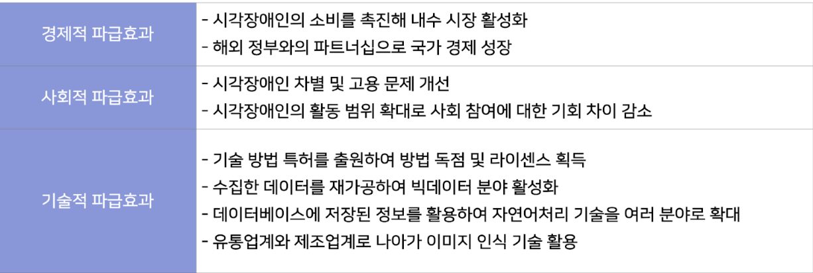

# eye-I-Shopping

<h1 align="center">
시각장애인 맞춤형 인공지능 기반  편리한 장보기 서비스
 

</h1>

# 목차 Index

- 개요
  - 시장 조사
  - 타 서비스와의 차별점
  - 파급효과
  - Architecture
- 유저 테스트
  - 서비스 활용 시나리오
  - 테스트 개선사항(버전 관리)
- Front-End
  - UI/UX
  - 문제해결 (TTS, CORS, 카메라 접근, 코드 구조화(클린코드))
- Back-End
- AI

# 1. 개요 Overview

<h2>시장 조사</h2>

시각 장애인을 주요 고객층으로 한 시장의 규모는 전 세계 3억명 국내 26만명이다. 
이들의 보조기기 시장 규모는 17조원이며, 국내 시각 장애인 이동통신단말기 시장은 500억 규모이다.

 
<h2>타 서비스와의 차별점</h2>

기존 서비스에서 제공하고 있지 않은 상품 매대인식 기능과 상품 세부정보와 유의사항을 TTS를 통해 제공하며 사용자의 사용경험을 향상시키기 위하여 음성 속도 조절 기능, 음성 선택 기능 등을 제공한다.

 
<h2>파급효과</h2>

 
<h2>Architecture</h2>

# 2. 버전 관리 및 테스트

<h2>서비스 활용 시나리오</h2>

 
<h2>버전 관리</h2>
<h6>1) 인식률 개선</h6>

<h6>2) GPT를 통한 자연어 처리</h6>

 
<h2>전문가 테스트</h2>

2023.06.01 
경기도 OO고등학교 통합교육반 김O수 선생님의 도움을 받아 시각장애인 2명을 대상으로 편의점에서 유저 테스트를 진행. 
  

# 3. Front-End

<h2>UI/UX</h2>
<h4>화면 구성</h4>

<h4>시각장애인 맞춤형 설계</h4>

- 보이스오버 기능과 TTS(Text-To-Speech) 기술을 통해 시각장애인의 접근성 및 사용성을 향상 
- 일관된 버튼 배치 구조로, 시각장애인 사용자의 사용성을 증진 
- 화면 컨트롤 영역을 확장하여 화면의 어느 부분을 터치해도 그에 설정된 동작이 실행

<h2>문제해결</h2>
<h4>CORS</h4>

-

<h4>TTS</h4>

-

<h4>카메라 접근</h4>

-

<h4>코드 가독성 및 유지보수</h4>

-
