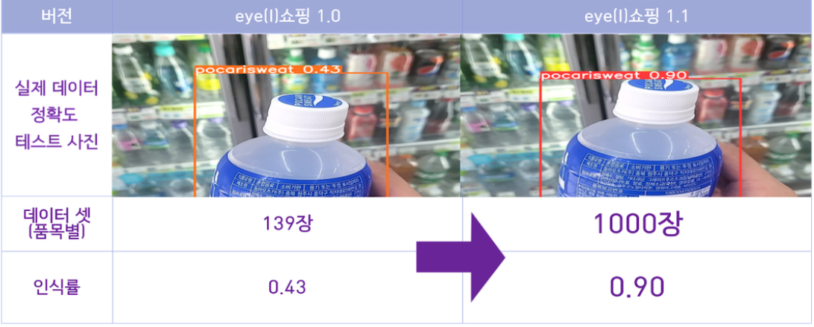

# 머신러닝과 ChatGPT를 활용한 시각장애인 맞춤형 구매 솔루션

<h1 align="center">

[아이쇼핑 바로가기](https://eyeshopping.shop:8443/#)

# 목차 Index

- 개요
  - 프로젝트 소개
  - 시장 조사
  - 파급효과
  - Architecture
- 버전 관리 및 테스트
  - 서비스 활용 시나리오
  - 버전 관리
  - 테스트
- Front-End
  - UI/UX
  - 문제해결
- AI
- Back-End

# 1. 개요 Overview

<h2>프로젝트 소개</h2>

> eye(I) 쇼핑은 시각장애인들이 스스로 제품을 판별하고 구매하는 과정에서 겪는 정보 접근성 문제를 머신러닝을 통한
> 사진인식 기술과 ChatGPT를 활용한 자연어 처리 기술을 융복합하여 맞춤형 정보를 제공합니다.

**기획 배경**

1. 시각장애인의 선택적 구매 욕구와 사용성을 충족시키는 개인화 서비스 부재
2. 시각장애인을 돕기 위한 서비스들이 존재하긴 하나, 사용성이 미흡함
3. 점자는 시각장애인의 기호를 무시하고 제품군만 표시하는 경우가 많으며, 때로는 전혀 표시하지 않는 경우도 빈번함

 
<h2>시장 조사</h2>

시각 장애인을 주요 고객층으로 한 시장의 규모는 전 세계 3억명 국내 26만명이며 
이들의 보조기기 시장 규모는 17조원이며, 국내 시각 장애인 이동통신단말기 시장은 500억 규모입니다.

 
<h2>Architecture</h2>

# 2. 버전 관리 및 테스트

<h2>서비스 활용 시나리오</h2>

 
<h2>버전 관리</h2>
<h6>1. GPT를 통한 자연어 처리</h6>

 
<h2>테스트</h2>

2023.06.01 
경기도 OO고등학교 통합교육반 김O수 선생님의 도움을 받아 시각장애인 2명을 대상으로 편의점에서 유저 테스트를 진행. 
  유저 의견을 먼저 반영하여 1.1버전으로 개선하였으며, 개선사항을 반영하여 추후 1.2버전으로 업데이트 예정

# 3. Front-End

<h2>UI/UX</h2>
<h4>화면 구성</h4>

<h4>시각장애인 맞춤형 설계</h4>

- 보이스오버 기능과 TTS(Text-To-Speech) 기술을 통해 시각장애인의 접근성 및 사용성을 향상 
- 일관된 버튼 배치 구조로, 시각장애인 사용자의 사용성을 증진 
- 화면 컨트롤 영역을 확장하여 화면의 어느 부분을 터치해도 그에 설정된 동작이 실행

<h2>문제해결</h2>
<h4>CORS</h4>

- CORS(Cross-Origin Resource Sharing)에러 해결방안

  - Middleware Proxy 서버 이용해 클라이언트와 서버 간 통신문제 해결

  <h4>TTS</h4>

- 네이버 CLOVA Voice

  - 사용자 개별 설정 값 전달: Session Storage에 2진법을 활용한 Voice, Speed, 제공받을 정보선택 값을 저장 후 요청
  - 금액: 네이버 클라우드 제공 Credit 활용

<h4>자동 재생 정책(Autoplay Policy)</h4>
  
  - 자동 재생 제한 에러

    - oncanplaythrough를 사용 : 오디오나 비디오의 메타데이터 로딩이 완료되고, 그 이후 미디어가 끝까지 재생되는 데 중단 없이 충분한 데이터가 있는 경우에 발생
    - setTimeOut 사용
    - 해당 Button에 오디오 매핑

  <h4>카메라 접근</h4>

- IOS 접근
  - 소스에 playsInline 추가하여 해결, 카메라는 https에서만 열기 가능.

# 5. AI

<h6>1) 인식률 개선</h6>

